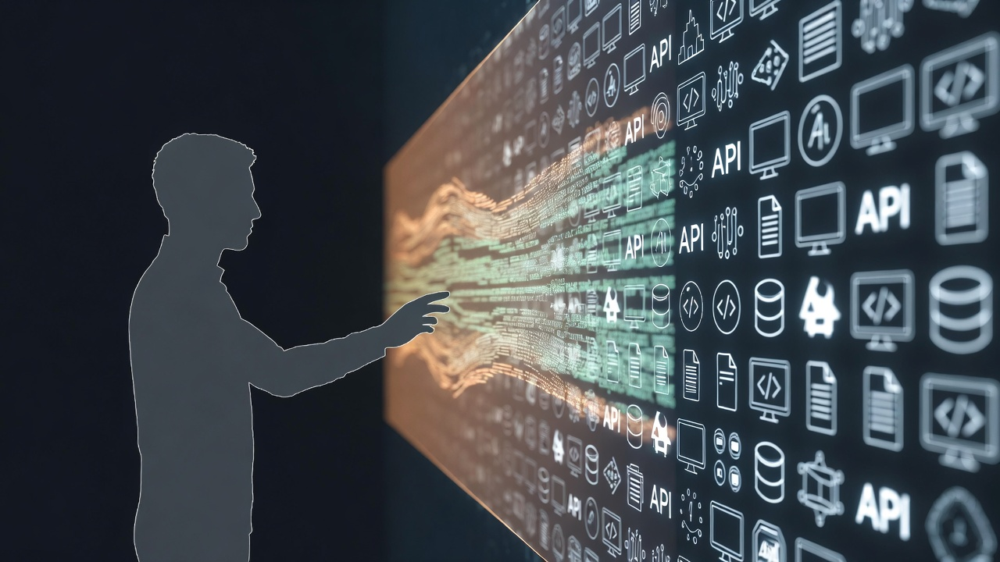
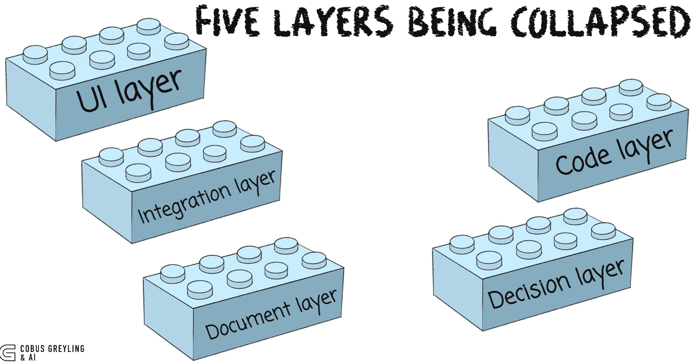

# AI is the New Human-System Mediation Layer

Blog post: *AI is the New Human-System Mediation Layer — Why Language Models Are Becoming the Universal Interface*

Every layer of software we interact with — UIs, APIs, CLIs, documents, databases — is being collapsed into a single mediation layer: the language model. This post traces the pattern across five layers being absorbed, the governance implications, and what changes for builders.

See [blog.md](blog.md) for the full post.
